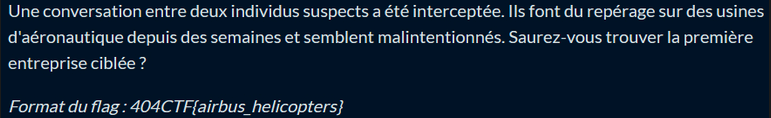
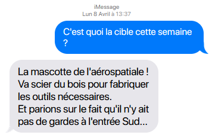
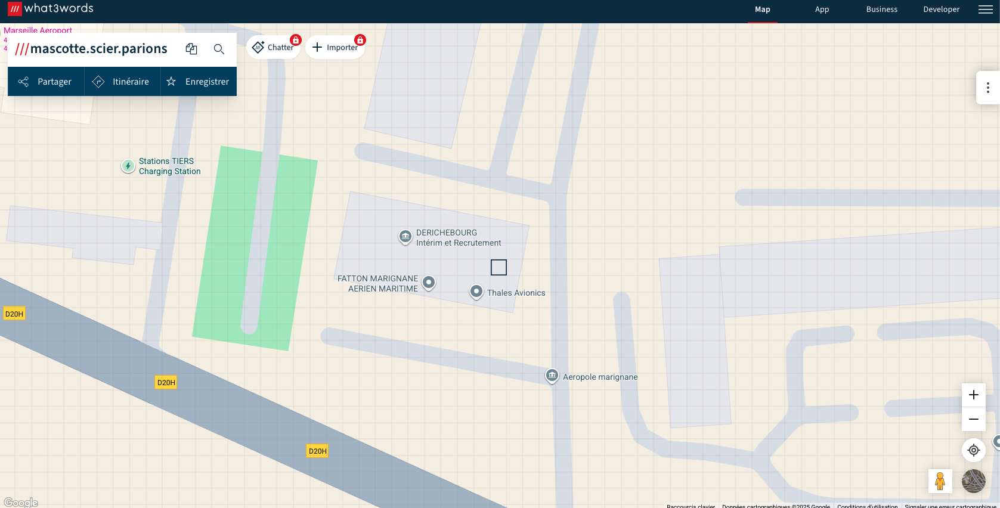

# Earth Attack (1/2)

**Événement :** 404CTF 2025  
**Catégorie :** Renseignement en Source Ouverte (OSINT)  
**Difficulté :** Difficile  

---

## 📸 Description  

---

## 🗂️ Ressources  
Une capture d'écran de la conversation :  

---

## 🧩 Résolution

Pour ce challenge, ma première piste a été l'analyse classique de la **localisation** à partir des éléments présents dans la conversation.  
On y évoque :

- une mascotte aérospatiale
- une proximité avec une forêt  
- une *entrée sud*

Ces indices oriententvers des entreprises françaises liées à l’aérospatial.  
Je commence donc par une exploration sur **Google** et **Google Maps**.

### 🔍 Piste 1 — Airbus / CNES  
Rapidement, je tombe sur un **poste de garde Airbus Defence & Space** indiqué sur Google Maps, situé juste à côté de l’entrée sud du CNES.  
Même s'il n'y à pas de foret aux alentours, je creuse… mais après inspection, aucune correspondance convaincante. 

Piste abandonnée.

---

### 🔍 Piste 2 — Recherche structurée via Overpass Turbo  
Je décide ensuite d’utiliser **Overpass Turbo** pour cartographier systématiquement :

- les bâtiments liés à l’aérospatial,  
- situés à moins de 10 km d’une forêt,  
- contenant un poste de garde ou une entrée sud.

Après plusieurs requêtes, aucun résultat pertinent. Je retente donc d'explorer la **Piste 1** puis je revient à la **Piste 2**, ainsi de suite pendant longtemps ...

---

### 🔍 Piste 2 Le format en trois phrases  
Puis, en relisant la conversation pour la centième fois, un détail finit par me faire légèrement tiquer :  
le message est structuré en trois phrases courtes.

Ce format me rappelle directement un service : **what3words** (https://what3words.com/)  
Un système qui associe chaque coordonnée du globe à un triplet de trois mots uniques.

Je tente l’approche, un peu sans y croire. Quels mots choisir ?
Je prends les premiers mots autre qu'un pronom de chacune des trois phrases :  
`mascotte`, `scier`, `parions`

Je les entre dans **what3words**… et là bingo !! Le point désigné tombe exactement sur un bâtiment de **Thales Avionics**.

---

## ✅ Flag  
404CTF{thales_avionics}
